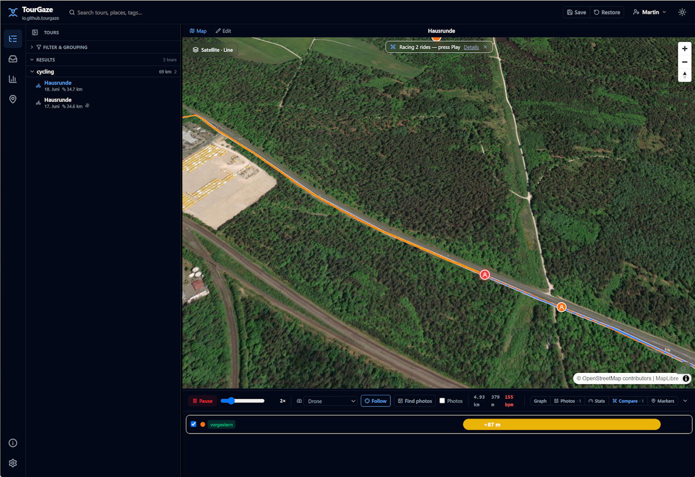

# 🐐 TourGaze

**Local-first ride viewer — import, browse, tag, replay, compare and analyse your tours.**
TourGaze turns the FIT / GPX / TCX / KMZ files from your bike computer, watch or
phone into a searchable, taggable library of rides — with a cinematic map
replay, advanced per-ride analytics, a ghost-chase compare mode, geo-matched
photos, and a JIRA-style faceted search across everything. It all runs on your
machine; your data never leaves it.

**🌐 Overview & screenshots: [tourgaze.github.io](https://tourgaze.github.io)**



> License: **AGPL-3.0** · No account, no cloud, no telemetry.

---

## Features

- **Import** FIT, GPX, TCX and **KMZ/KML** (OpenTracks) — drop into the inbox, or
  let the Garmin device auto-scan pick up new `.fit` files. Import pre-fills a
  sensible activity type and **guesses the gear** from your past similar rides.
- **Browse & filter** with a faceted mini-language:
  `sport:cycling year:2014..2018 gear:"Race Bike" tag:alpine dist:>50`.
- **Hierarchical tags** (a parent matches all descendants), drag-to-apply, recursive filtering.
- **Gear** (bikes / shoes / …) with per-gear stats and bulk-assign across filtered rides.
- **Cinematic replay** — drone / helicopter / follow / top-down cameras
  (precomputed, buttery-smooth path; the drone steers by your general direction),
  with a rider marker, HR/slope-coloured track, photo fades — and a little
  **rain animation** when you ride through a detected shower.
- **Ride events** — typed moments pinned on the replay map: **rain showers are
  auto-detected on import** from the weather along your track, and you add your
  own (drink break, puncture, viewpoint, …) by clicking the map. Event kinds are
  user-managed masterdata (name + icon + colour) in Settings.
- **Custom attributes** — annotate any ride with free-form key/values (stored as
  JSON), editable in an Events tab on the ride.
- **Elite stats** — best efforts, climbing & VAM, gradient distribution, HR zones,
  training load (TRIMP), aerobic decoupling, estimated cycling power (NP / VI) and
  **calorie burn** (mechanical work when power is present, otherwise a Keytel
  heart-rate estimate).
- **Raw data view** — every channel a ride recorded (elevation, HR, speed,
  cadence, power) as per-channel charts and a **virtualised table of all
  samples**, with the ride's summary totals; the per-ride sensor set is detected
  on import. Reached from the **Raw** link in the viewer.
- **Compare (ghost-chase)** — finds rides on the *same route* (GPS overlap, of a
  comparable length) and races them: a live HUD (distance / time / HR gap) and a
  Mario-Kart off-screen arrow when a ghost leaves the viewport.
- **Markers** — global points of interest (food, viewpoint, peak, …) with
  categories and an editable description, shown on the map and a filterable
  list with click-to-jump (a ride only shows the markers near its route).
- **Photos & video** — drop your own (geo-matched by EXIF, shown as map pins, faded
  in during replay, in a gallery), or **auto-discover** Creative-Commons photos
  along the route from Wikimedia Commons. Public vs personal are clearly labelled;
  big uploads are downscaled (EXIF preserved).
- **Dashboard** — distance / elevation / time by year, sport and gear, with
  motor-assisted (e-bike) rides kept separate from your human-powered totals.
- **Custom basemaps** — raster XYZ or vector styles, managed in Settings.
- **Backup & recovery** — everything is local; per-ride `*.metadata.json` sidecars
  are written on every change, and a one-click ZIP export recreates the original
  dropped files.

## Download & run

Grab a build from the **[latest release](https://github.com/tourgaze/tourgaze/releases/latest)** —
no build tools required:

- **Windows / Linux portable** (`*-windows-portable.zip`, `*-linux.tar.gz`) — a
  self-contained app image with its **own bundled Java runtime**. Unpack and run;
  **no Java and no Node needed.**
- **Headless JAR** (`*-headless.jar`) — for a server / NAS. Needs only a **Java 21
  runtime (JRE)** — no Node:

  ```bash
  java -jar TourGaze-*-headless.jar      # → http://localhost:8085
  ```

Or run it [with Docker](#run-with-docker) (below).

Open the app, complete the first-run setup to create your rider profile, then
drop a `.fit` / `.gpx` / `.tcx` / `.kmz` into `~/.tourgaze/inbox/` (or upload from
the Inbox view) and click **Import**.

## Run from source (development)

**Prerequisites (source build only):** JDK 21+, Node 20+.

```bash
# Backend  → http://localhost:8085
cd server && mvn spring-boot:run

# Frontend → http://localhost:5173  (dev server, proxies /api → 8085)
cd frontend && npm install && npm run dev
```

Open <http://localhost:5173> and complete the first-run setup as above.

## Run with Docker

TourGaze ships as a **single container** — the API and the web UI are served
together on port `8085`. State (H2 DB, media, cache, tiles) lives under a
`/data` volume.

Pull the published **`mschwehl/tourgaze`** image and run it:

```bash
docker pull mschwehl/tourgaze
docker run -d --name tourgaze -p 8085:8085 -v tourgaze-data:/data mschwehl/tourgaze
# → open http://localhost:8085
```

That mounts a named `tourgaze-data` volume (swap for a bind mount
`-v "$PWD/data:/data"` to keep the library host-visible). To encrypt the store
at rest — so the volume can safely sync to a cloud folder — add
`-e TOURGAZE_STORE_CRYPTOR=AES-GCM -e TOURGAZE_STORE_PASSWORD=… -e TOURGAZE_STORE_SALT=…`;
**lose the password or salt and the data is unrecoverable.**

Or build the image from source (for development):

```bash
# from the project root: build the SPA + jar, then the image
cd frontend && npm ci && npm run build && cd ..
mvn -f server/pom.xml clean package -DskipTests
docker compose -f infra/docker-compose.yml up --build   # → http://localhost:8085
```

## Deploy with Helm

A production chart lives in `helm/tourgaze/` (Deployment + Service + Ingress +
persistent volume):

```bash
helm install tourgaze ./helm/tourgaze \
  --set ingress.hosts[0].host=tourgaze.example.com \
  --set persistence.storageClass=<your-storage-class>
```

Single replica only — the H2 file DB isn't horizontally scalable. The default
ingress allows 100 MB uploads (FIT/GPX/KMZ + photos). See
[README-dev.md](README-dev.md#docker--helm) for the full knobs.

## Data & privacy

Everything lives under `~/.tourgaze/` (override with `TOURGAZE_DATA_DIR`):

```
~/.tourgaze/
  repository/   the precious, cloud-syncable library — the only folder worth backing up
    store/      original ride files + <name>_media/ photos + <name>.metadata.json sidecars
    db-backup/  rotating H2 snapshot zips (newest 5 kept)
  db/      H2 database (ride metadata, gear, tags, markers — rebuildable from the sidecars)
  cache/   derived track / chart JSON (regenerable)
  tiles/   cached map tiles (re-downloadable)
```

Point `repository/` at a cloud-synced folder to back it up off-machine — set
`TOURGAZE_REPOSITORY_DIR` (e.g. a Dropbox / Google Drive path); everything else
stays local and rebuilds from the sidecars.

No accounts, no cloud, no telemetry. Map tiles are fetched once and cached locally.

> **⚠️ No authentication.** TourGaze is a single-user, local-first app — it has
> no login. Run it on `localhost` or a trusted LAN. **Do not expose it directly
> to the internet**; if you must, put it behind a reverse proxy that adds
> authentication (and TLS). The library can be **encrypted at rest** (AES-GCM,
> opt-in) so the store can safely sync to a cloud folder — see the Docker section.

## Tech stack

Vue 3 + Vite + TypeScript · Spring Boot 3 (Java 21) · H2 · MapLibre GL · ECharts ·
TanStack Query · Tailwind · Garmin FIT SDK · jpx (GPX) · GeographicLib (distance) ·
metadata-extractor + commons-imaging (EXIF) · MapStruct · Lucide.

## Attribution

Map data © OpenStreetMap contributors; basemap styles © CARTO / Esri / OpenFreeMap;
discovered photos © their authors via Wikimedia Commons (CC); weather from
Open-Meteo; reverse geocoding from Nominatim. Full credits on the in-app **About** page.

## Contributing

Developer guide: **[README-dev.md](README-dev.md)**. See also
[CONTRIBUTING.md](CONTRIBUTING.md) and [CHANGELOG.md](CHANGELOG.md).

**A file won't import or looks wrong?** Drop a copy in
**[tourgaze/tourgaze-testdata](https://github.com/tourgaze/tourgaze-testdata)** so
we can reproduce and fix it.

## License

[GNU AGPL-3.0](LICENSE) © TourGaze contributors. If you run a modified version as a
network service, you must offer your users the corresponding source.

### Additional permission (AGPL v3 §7) — Garmin FIT SDK

The Garmin FIT SDK that TourGaze uses to read `.fit` files is distributed under
Garmin's own proprietary *FIT Protocol License*, which is not GPL-compatible. To
remove any doubt about combining it with AGPL-licensed code:

> As a special exception, the copyright holders of TourGaze grant you, under
> section 7 of the GNU Affero General Public License version 3, additional
> permission to combine or link TourGaze with the **Garmin FIT SDK** (the
> "FIT SDK") and to convey the resulting work. The GNU AGPL v3 continues to
> govern the TourGaze portions; the FIT SDK remains governed by its own license.
> This permission applies only to the combination with the FIT SDK and does not
> otherwise limit the AGPL.

If you fork TourGaze, keep this exception (or replace the FIT SDK) so the
combined work stays distributable.
